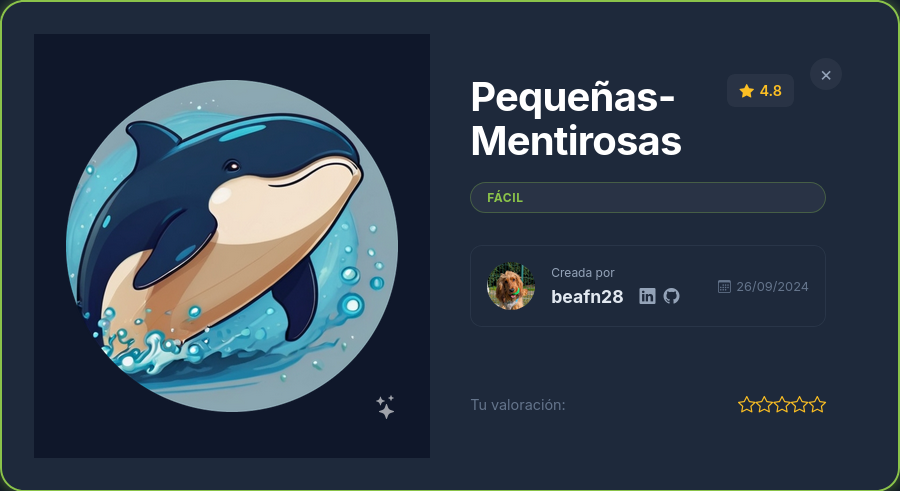
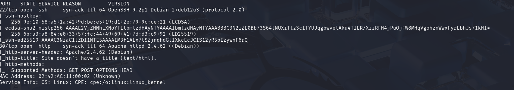
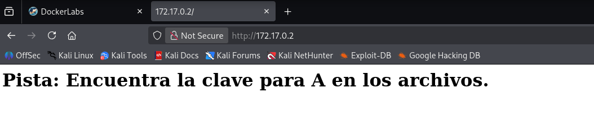
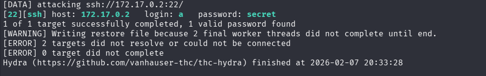
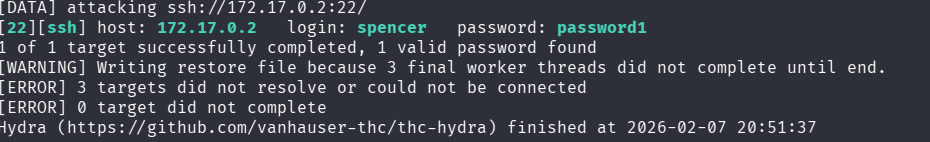
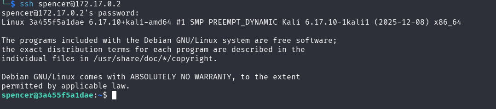
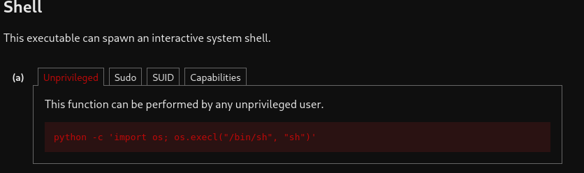
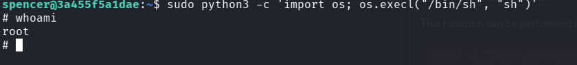

# **PEQUEÑAS-MENTIROSAS**

**Plataforma:** Dockerlabs

**Dificulad:** Fácil

**SO:** Linux

## Descripción
Explotación de vulnerabilad en un servicio web

### Escaneo de puertos con NMAP

**nmap -p- -sC -sV -sS --min-rate 5000 -n -vvv -Pn 172.17.0.2**

Resultado del escaneo:

Puerto 22 ssh 

Puerto 80 servidor apache

Veo que corre en el puerto 80

Al decir encuentra la clave para "A", quizas sea el usuario.
Lanzo ataque de fuerza bruta con Hydra apuntando hacia ese posible usuario.

**hydra -l a -P /usr/share/wordlists/rockyou.txt ssh://172.17.0.2**

El ataque con hydra me da el siguiente resultado:

Usuario: a

Contraseña: secret

Con el usuario y la contraseña accedemos vía SSH

Ya dentro de la maquina sin encontrar nada más aparte de otro usuario "spencer"

Por lo que lanzo nuevamente ataque de fuerza bruta con hydra

**hydra -l spencer -P /usr/share/wordlists/rockyou.txt ssh://172.17.0.2**

Obtengo nuevamente resultados:

Usuario: spencer

Contraseña: password1

Accedo nuevamente vía SSH

Estoy dentro

Uso sudo para ver si hay algún binario que pueda usar 

Busco en GTFOBins como puedo escalar privilegios con este binario

El comando original de GTFOBins usa sudo python, el unico cambio es usar python3 para que el comando

Maquina comprometida

**Somos root**